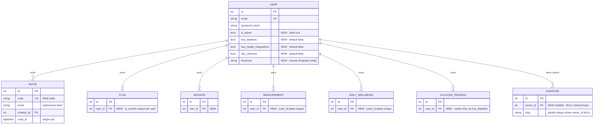
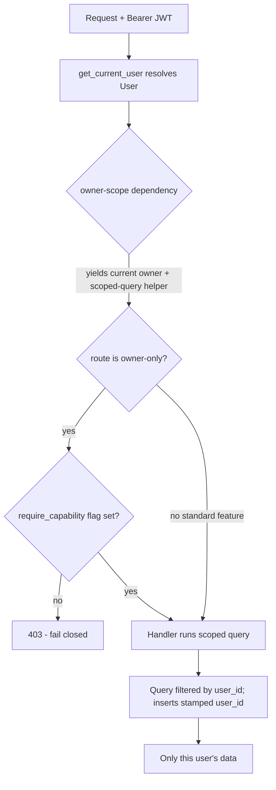

# feat: Make the training app multiuser (independent owners, capability-gated)

## Summary

The training app already has the *machinery* of auth — JWT login, bcrypt, a `user` table, `get_current_user` injected into nearly every endpoint, and an `owner`/`trainer` role model — but it has no **data ownership**. Not one domain table carries a `user_id`; every query returns the single global dataset, and the app only works because exactly one owner exists (`backend/app/api/tracking.py`, plus a repo-wide grep, confirm auth-only `CurrentUser` with no filtering).

This plan adds a per-owner data axis to every domain table, enforces it through a single composable scope dependency so it cannot be forgotten, retires the `trainer` role, and introduces **per-user capability flags** so invited users get a workout- and diet-centric app while the owner (Seth) retains the full T1D/health-integration experience. Accounts are invite-only. Existing production data backfills to the owner via an unattended-safe Alembic migration.

---

## Problem Frame

Going multiuser is not an auth task — auth exists. It is a **data-isolation and capability-gating** task:

1. **No ownership axis.** Every domain table (`plan`, `session`, `measurement`, `daily_wellbeing`, `glucose_reading`, …) is implicitly the one owner's. Adding a second user today would leak all data to everyone and collide on the many `date`-unique constraints.
2. **Non-uniform product.** The app must no longer be uniform: invited users get workout + diet + shopping + assistant + body measurements + daily wellbeing. T1D (glucose/insulin), health integrations (Google Health, Tidepool), and progress check-ins are **owner-only**.
3. **Unattended production migration.** Railway auto-deploys `main` and runs `alembic upgrade head` on container boot (`Dockerfile` CMD). The schema change plus backfill of existing rows runs once, unattended, against live data before the app serves traffic.
4. **Test harness cannot see the risk.** Tests build the schema on SQLite via `Base.metadata.create_all` (not the migrations); prod is Postgres/asyncpg. Per-user composite unique constraints, FK enforcement, NOT NULL timing, and NULL-uniqueness semantics all differ between the two — green tests will not prove prod-safe.

---

## Requirements

- **R1 — Owner isolation (fail-closed).** Every domain table is scoped to an owner. No endpoint, service, or assistant tool may return or mutate another user's data. Ambiguity (missing/failed owner resolution) resolves to *no data*, never another user's rows.
- **R2 — Invite-only provisioning.** No public signup. An admin (Seth) creates users directly and/or generates single-use invite codes; registration consumes an invite code (email + password + code → account).
- **R3 — Independent owners.** The `trainer` role and its read-only guard are retired. Every user is an independent owner of their own data; there is no cross-user viewing in v1.
- **R4 — Capability gating (default off).** Per-user flags gate T1D/diabetes, health integrations (Google Health + Tidepool), and progress check-ins to the owner only. Flags default off; both API and frontend enforce them.
- **R5 — Standard user surface.** Invited users get: training/workouts, diet/meals, shopping lists, the assistant, body measurements, and daily wellbeing/mood/energy.
- **R6 — Shared assistant, scoped data.** The Anthropic assistant uses a single shared global API key. Assistant/MCP tools operate only on the current user's data.
- **R7 — Exercise catalog: shared base + per-user custom.** A shared base catalog (`owner_id IS NULL`) is readable by all; each user may own custom exercises. Exercise queries merge global + the current user's custom rows; plan-commit creates custom exercises under the current user.
- **R8 — Safe production migration.** Existing rows backfill to the owner account. `date`-unique constraints (5 tables) and `plan.is_current` become per-user composite constraints. The migration is idempotent, reversible, and safe to run unattended on Railway boot; it is verified against local Postgres before push.
- **R9 — Per-user timezone.** Timezone moves off global config onto the `User` row; date logic (`app/clock.py`) uses the current user's zone.
- **R10 — Isolation & gating test coverage.** Tests prove cross-user data cannot leak, capability gating denies non-owners, and invite/registration works — verified against Postgres for the constraint-sensitive paths.

---

## Key Technical Decisions

- **KTD1 — One composable owner-scope dependency, not sprinkled filters.** Mirror the existing `enforce_role_access` pattern (`backend/app/api/deps.py`): a single injectable that yields the current owner and a scoped-query helper, applied so a new endpoint cannot silently omit the filter. This is the structural expression of the fail-closed rule (see origin memory `feedback-fail-closed-permissions`). Ad-hoc per-route `.where()` calls are the fail-open trap and are rejected.
- **KTD2 — Capability flags as booleans on `User`, default off.** `has_diabetes`, `has_health_integrations`, `has_checkins` on the `user` row (default `False` via `server_default`). Seth's account gets them on in the backfill. A `require_capability(...)` dependency gates the owner-only routers; the frontend gates navigation on the same flags exposed via `GET /auth/me`. Chosen over a "tier"/"plan" enum because the capabilities are independent and the boolean default naturally fails closed.
- **KTD3 — Exercise: nullable `owner_id` with split uniqueness.** `owner_id NULL` = shared base; non-null = user's custom. Postgres: a **partial unique index** on `slug WHERE owner_id IS NULL` enforces global-slug uniqueness (a plain composite unique would not, because Postgres treats NULLs as distinct), plus a composite `UNIQUE(owner_id, slug)` for custom rows. Exercise reads use `WHERE owner_id IS NULL OR owner_id = :user_id`. **This is exactly the class of behavior the SQLite/Postgres divergence hides** — must be verified on Postgres.
- **KTD4 — Two-step migration, unattended-safe.** Step A (additive): add nullable `user_id` + capability flags + `timezone` + `is_admin`, add `owner_id` to `exercise`, then backfill every existing row to the owner id. Step B (enforce): set `user_id` NOT NULL, drop the old single-column `date`-unique constraints and add per-user composites, add the exercise unique indexes. Split so backfill precedes NOT NULL; both `upgrade()` and `downgrade()` implemented; idempotent because it runs once on boot with no manual gate.
- **KTD5 — Retire `trainer`; add `is_admin`.** The `owner`/`trainer` `role` column and `enforce_role_access` are removed. Admin capability (create users, mint invites) is a new `is_admin` boolean on `User`; Seth = admin in the backfill. Keeps the access axis minimal now that cross-user viewing is out of scope.
- **KTD6 — Integrations stay owner-only; no per-user OAuth rework.** Because only Seth uses Google Health + Tidepool, the global `integration_setting` store and the single OAuth state/refresh-token stay as-is but are gated behind `has_health_integrations` and locked to the owner; synced health rows are stamped with the owner's `user_id`. This avoids the substantial per-user OAuth redesign that would otherwise be needed and is correct because no other user can reach these endpoints. (If integrations are ever opened to other users, per-user credential records become required — noted in Open Questions.)
- **KTD7 — Assistant tools scoped to current user.** `backend/app/assistant/tools.py`, `agent.py`, `mcp_server.py` receive the current user id and scope every read/write, so the shared-key assistant never crosses users.

---

## High-Level Technical Design

### Data model: the ownership + capability axes

*(Representative tables shown; every root domain table gains `user_id`. Child tables — `set_entry`, `prescription`, `meal`, `check_in_photo`, `shopping_item`, etc. — inherit ownership through their parent FK and are scoped by joining through it.)*

### Request path: scope + capability enforced in dependencies

---

## Scope Boundaries

**In scope:** owner-scoping every domain table + query + insert; the composable scope dependency; per-user capability flags and gating (API + frontend); retiring the trainer role; invite-only provisioning (admin create + invite codes + registration); shared-base/per-user-custom exercise catalog; per-user timezone; locking Google Health + Tidepool to the owner and stamping synced data; scoping the assistant; the backfill migration; the frontend capability-driven UI and registration screen; the isolation/gating/invite test suite.

### Deferred to Follow-Up Work
- Per-user Google Health / Tidepool OAuth connect flows (only needed if integrations are opened beyond the owner).
- Public self-service signup, email verification, password reset, rate-limiting.
- A Postgres-backed CI path (strongly recommended — see Risks — but a separate infra change).
- Cross-user features (a user sharing data with a coach) — explicitly out per the chosen actor model.

### Out of scope (product identity)
- Any cross-user data visibility in v1. Every user is an isolated owner.

---

## Implementation Units

### Phase 1 — Data model & migration foundation

### U1. Add ownership, capability, and timezone columns to models; rework constraints
- **Goal:** Introduce the ownership and capability axes at the ORM layer and redefine every single-user unique constraint as per-user.
- **Requirements:** R1, R4, R7, R8, R9
- **Dependencies:** none
- **Files:** `backend/app/models/user.py`, `backend/app/models/plan.py`, `backend/app/models/training_log.py`, `backend/app/models/wellbeing.py`, `backend/app/models/health.py`, `backend/app/models/checkin.py`, `backend/app/models/shopping.py`, `backend/app/models/base.py`, `backend/app/models/__init__.py`; new `backend/app/models/invite.py`
- **Approach:**
  - Add to `User`: `is_admin`, `has_diabetes`, `has_health_integrations`, `has_checkins` (bool, `server_default` false), `timezone` (str, `server_default` the current global tz). Remove the `role` column (owner/trainer) — see U8 for guard removal.
  - Add `user_id: Mapped[int] = mapped_column(ForeignKey("user.id", ondelete="CASCADE"), index=True)` to every **root** table: `plan`, `session`, `mobility_done`, `meal_check`, `daily_wellbeing`, `daily_log`, `measurement`, `steps_day`, `sleep_night`, `glucose_reading`, `insulin_event`, `check_in`, `shopping_list`. Child tables (`training_day`, `prescription`, `weekday_schedule`, `meal`, `meal_ingredient`, `set_entry`, `check_in_photo`, `shopping_item`) stay parent-scoped.
  - Rework unique constraints to per-user composites: the five `date`-unique tables (`daily_wellbeing`, `daily_log`, `measurement`, `steps_day`, `sleep_night`) → `UniqueConstraint("user_id", "date")`; `mobility_done` → `(user_id, date, exercise_id)`; `meal_check` → `(user_id, date, meal_id)`; `plan.is_current` becomes unique-per-user (partial unique index `WHERE is_current`).
  - `exercise`: add nullable `owner_id` FK; keep `slug` but move uniqueness to migration-defined indexes (KTD3). Model declares the composite `UNIQUE(owner_id, slug)`; the partial global-slug index is added in the migration (SQLAlchemy `Index(..., postgresql_where=...)`).
  - New `Invite` model: `code` (unique), optional bound `email`, `created_by` FK, `used_at` nullable, timestamps.
- **Patterns to follow:** `Mapped[]`/`mapped_column`, `TimestampMixin` in `base.py`; existing composite `__table_args__` on `mobility_done`/`meal_check`; FK naming + `index=True` per `agent-os/standards/backend/models.md`.
- **Test scenarios:**
  - Model-metadata test: every root table listed above exposes a `user_id` column and index. *(Covers R1.)*
  - Composite-uniqueness unit test per reworked table: two rows same `(user_id, date)` conflict; same `date` different `user_id` coexist. *(Covers R8; must also run on Postgres — see U11.)*
  - `Exercise` accepts `owner_id=None` (base) and a set value (custom).
  - `Invite` round-trips with a unique code; duplicate code rejected.
- **Verification:** models import cleanly; `mypy app` passes with the new `Mapped[int]` columns; a fresh `create_all` builds the schema.

### U2. Alembic migration — additive schema, backfill to owner, then enforce
- **Goal:** Evolve the production schema safely, unattended, with existing data backfilled to the owner.
- **Requirements:** R8
- **Dependencies:** U1
- **Files:** two new files in `backend/migrations/versions/`; reference `backend/migrations/env.py`
- **Approach:**
  - **Migration A (additive + backfill):** add nullable `user_id` to all root tables; add `User` capability flags + `is_admin` + `timezone`; add `exercise.owner_id`; create `invite` table. Then backfill: resolve the single existing owner's id (the lone `user` row, or the row matching `SEED_EMAIL`) and `UPDATE` every root table's `user_id` to it; set that user `is_admin=true`, `has_diabetes=true`, `has_health_integrations=true`, `has_checkins=true`, `timezone` = the previous global config value. Leave `exercise.owner_id` NULL (existing catalog becomes the shared base).
  - **Migration B (enforce):** `ALTER` `user_id` to NOT NULL on all root tables; drop old single-column `date`-unique constraints and create the per-user composites; create the `plan.is_current` partial unique index; create the exercise partial-unique (`WHERE owner_id IS NULL`) + composite `(owner_id, slug)` indexes.
  - Implement `downgrade()` for both. Guard the backfill so it no-ops if no user row exists (fresh DB from `create_all` in tests won't hit these migrations, but a fresh Postgres deploy might).
- **Execution note:** Verify against **local Postgres** (`localhost:5432`, db `training`) before push — reach prod-shaped data via the Railway `DATABASE_PUBLIC_URL` proxy per memory `project-railway-deploy-and-migrations`. Confirm the partial unique indexes and NOT NULL timing behave as intended (SQLite cannot prove this).
- **Test scenarios:**
  - Postgres integration (U11): run `alembic upgrade head` on a Postgres DB seeded with pre-migration single-user data; assert all rows carry the owner `user_id`, owner flags are on, and constraints exist.
  - `downgrade()` then `upgrade()` round-trips without error.
  - Backfill no-ops cleanly on an empty database.
- **Verification:** `alembic upgrade head` succeeds on a Postgres copy of prod data; a second `upgrade` is a no-op; app boots and serves the owner's data unchanged.

---

### Phase 2 — Ownership scoping enforcement

### U3. Composable owner-scope dependency + thread `user_id` through routers and services
- **Goal:** Make every read filter by, and every write stamp, the current user — enforced structurally.
- **Requirements:** R1, R6
- **Dependencies:** U1, U2
- **Files:** `backend/app/api/deps.py`; all domain routers under `backend/app/api/` (`tracking.py`, `daily.py`, `plans.py`, `checkin.py`, `diabetes.py`, `workouts.py`, `shopping.py`, `sleep.py`, `imports.py`, `assistant.py`, `sync.py`); services under `backend/app/services/` (`daily.py`, `shopping.py`, `plan_commit.py`, and others)
- **Approach:**
  - Add an owner-scope dependency to `deps.py` that yields the current user and a small scoped-query helper (e.g. `scope(stmt, model)` → adds `.where(model.user_id == user.id)`), plus an `owned_or_404(...)` fetch helper for single-row access by id.
  - Thread `user.id` into every service function signature; add `.where(Model.user_id == user.id)` to every read and `user_id=user.id` to every insert. For plan-scoped queries, join through `plan.user_id`.
  - Fix singleton-plan logic to be per-user: `services/daily.py` (current-plan lookup), `services/shopping.py`, `services/plan_commit.py` (the `is_current` flip must scope to the committing user).
- **Patterns to follow:** existing `SessionDep` / `CurrentUser` DI; the router-wide guard pattern of `enforce_role_access`; `agent-os/standards/backend/api.md` (composable dependency guards).
- **Test scenarios:**
  - **Isolation (core):** user A creates a plan/session/measurement; user B's `GET` on the same endpoints returns only B's rows, never A's. *(Covers R1.)*
  - Write stamping: an insert by user A is retrievable by A and invisible to B.
  - `owned_or_404`: user B requesting user A's resource by id gets 404, not A's data.
  - Per-user current plan: A and B can each have their own `is_current` plan simultaneously; committing A's new plan does not touch B's.
  - Regression: the owner's existing single-user flows still return the same data post-scoping.
- **Verification:** the isolation test suite (U11) is green on both SQLite and Postgres; no domain query lacks a user filter (grep + review).

### U4. Exercise catalog — shared base + per-user custom
- **Goal:** Let all users read the shared base catalog while owning their own custom exercises, without slug collisions.
- **Requirements:** R7
- **Dependencies:** U1, U2, U3
- **Files:** `backend/app/services/plan_commit.py`, exercise-read paths in `backend/app/services/` and `backend/app/api/` (workouts/plans), `backend/app/assistant/tools.py`
- **Approach:**
  - Exercise reads: `WHERE owner_id IS NULL OR owner_id = :user_id`.
  - `plan_commit`: when resolving an exercise by slug, prefer an existing global (`owner_id IS NULL`) or the user's own custom row; if none exists, create it as the user's custom (`owner_id = user.id`) — never mutate the shared base.
  - Guard the partial-unique semantics explicitly (KTD3) so two users creating the same custom slug do not collide with each other or with a global.
- **Test scenarios:**
  - User A sees base exercises + A's custom; not B's custom. *(Covers R7.)*
  - Two users create a custom exercise with the same slug → both succeed, distinct rows.
  - A custom slug that duplicates a global slug is allowed as a custom row (does not violate the partial index). *(Postgres — U11.)*
  - Plan-commit reuses a global exercise rather than duplicating it.
- **Verification:** exercise queries never surface another user's custom rows; Postgres partial index holds under the collision tests.

### U5. Scope the assistant and MCP tools to the current user
- **Goal:** Ensure the shared-key assistant only ever reads/writes the current user's data.
- **Requirements:** R1, R6
- **Dependencies:** U3
- **Files:** `backend/app/assistant/tools.py`, `backend/app/assistant/agent.py`, `backend/app/assistant/mcp_server.py`, `backend/app/api/assistant.py`
- **Approach:** pass the authenticated user id into the agent/tool constructors; every tool query uses the U3 scope helper; capability-gated data (T1D/health) is only exposed when the user's flags allow (defense in depth with U6).
- **Test scenarios:**
  - Assistant chat as user B cannot read or mutate user A's plans/logs. *(Covers R1.)*
  - A standard (non-diabetes) user's assistant has no access to glucose/insulin data or tools.
  - Owner's assistant retains full access (regression).
- **Verification:** assistant tool calls carry the user scope; cross-user assistant access test is green.

---

### Phase 3 — Capability gating & integration lockdown

### U6. Capability-flag gating dependency; gate diabetes / health / check-in endpoints
- **Goal:** Enforce the capability split server-side, default-deny.
- **Requirements:** R4, R5
- **Dependencies:** U1, U3
- **Files:** `backend/app/api/deps.py`; `backend/app/api/diabetes.py`, `backend/app/api/sleep.py`, `backend/app/api/checkin.py`, `backend/app/api/sync.py`, `backend/app/api/settings.py`, `backend/app/main.py` (router wiring)
- **Approach:** add a `require_capability(flag)` dependency that 403s when the current user's flag is false; apply it to the diabetes/insulin routes (`has_diabetes`), the Google Health + Tidepool + steps/sleep sync routes and `/settings` integration management (`has_health_integrations`), and the check-in routes (`has_checkins`). Expose the three flags in `GET /auth/me` for the frontend.
- **Patterns to follow:** `enforce_role_access` composition; fail-closed default (`feedback-fail-closed-permissions`).
- **Test scenarios:**
  - Non-owner without `has_diabetes` gets 403 on every diabetes/insulin route. *(Covers R4.)*
  - Non-owner without `has_health_integrations` gets 403 on sync + `/settings` integration routes.
  - Non-owner without `has_checkins` gets 403 on check-in routes.
  - Owner (all flags on) reaches all of them (regression).
  - `GET /auth/me` returns the three flags.
- **Verification:** gating suite green; `main.py` wires `require_capability` on the owner-only routers.

### U7. Lock Google Health + Tidepool to the owner; stamp synced data
- **Goal:** Keep integrations owner-only and correct under the new ownership axis without a per-user OAuth rework.
- **Requirements:** R4, R6, R8
- **Dependencies:** U3, U6
- **Files:** `backend/app/integrations/health.py`, `backend/app/integrations/tidepool.py`, `backend/app/services/settings.py`, `backend/app/api/sync.py`
- **Approach:** sync stamps `user_id` = the owner (only the owner can reach these routes via U6); Tidepool dedup and Google Health upserts key on `(user_id, ts/date)` to match the reworked constraints; the global `integration_setting` store and single OAuth state/refresh-token stay as-is (KTD6). Add a code comment marking these as owner-only so a future per-user opening is a deliberate change.
- **Test scenarios:**
  - Owner sync writes glucose/steps/sleep stamped with the owner id and respects the per-user unique keys. *(Covers R8.)*
  - Tidepool re-sync dedups within the owner's rows only (no cross-user dedup path exists).
  - `Test expectation: none` for the untouched global `integration_setting` CRUD beyond the U6 gating already covered.
- **Verification:** owner integration sync still works end to end; synced rows carry the owner id.

---

### Phase 4 — Auth & provisioning

### U8. Retire the trainer role; add `is_admin`; wire per-user timezone
- **Goal:** Remove the read-only trainer axis and move timezone onto the user.
- **Requirements:** R3, R9
- **Dependencies:** U1, U2
- **Files:** `backend/app/api/deps.py` (remove `enforce_role_access`), `backend/app/main.py` (remove its wiring), `backend/app/api/auth.py`, `backend/app/security.py`, `backend/app/clock.py`, `backend/app/config.py`, `backend/app/seed.py`
- **Approach:**
  - Delete `enforce_role_access` and its `main.py` middleware/dependency wiring; remove `role` references from `auth.py`/`security.py`.
  - `clock.py`: `local_today`/`local_now` take the current user's `timezone` instead of `settings.timezone`; update callers to pass the user's zone (thread from the scope dependency). Keep `settings.timezone` only as the default applied at user creation/backfill.
  - Update `seed.py` and the `main.py` lifespan auto-seed to create the owner with `is_admin=true` and all capability flags on.
- **Test scenarios:**
  - No route enforces read-only-trainer behavior any more; a normal user can write to their own data. *(Covers R3.)*
  - `local_today` returns the correct day for two users in different timezones. *(Covers R9.)*
  - Seeded owner has `is_admin` and capability flags set.
- **Verification:** trainer guard fully removed (grep); date logic uses per-user tz; `mypy`/`ruff` clean.

### U9. Invite-code model + admin user-create + registration flow
- **Goal:** Provide invite-only account creation end to end.
- **Requirements:** R2
- **Dependencies:** U1, U2, U8
- **Files:** new `backend/app/api/invites.py` (admin: mint/list invites), new/updated `backend/app/api/auth.py` (`POST /auth/register` consuming a code), new `backend/app/services/invites.py`, `backend/app/api/deps.py` (an `admin_only` dependency), `backend/app/main.py` (router wiring); optionally a CLI in `backend/app/seed.py` or `tasks.py`
- **Approach:**
  - `admin_only` dependency (403 unless `is_admin`) guards invite minting and any admin user-create route.
  - `POST /auth/register`: validate the invite code (exists, unbound-or-email-matches, `used_at` null), create the user with default-off capability flags and the default timezone, mark the invite used atomically (guard against reuse under concurrency).
  - Invited users are created as standard users (capability flags off) — the owner's elevated flags are set only in the backfill / seed.
- **Test scenarios:**
  - Valid unused code → account created, flags default off, code marked used. *(Covers R2, R4.)*
  - Reused/expired/unknown code → 4xx, no account.
  - Concurrent redemption of one code creates at most one account (atomic `used_at` guard).
  - Non-admin calling invite-mint or admin user-create → 403. *(Covers R2 fail-closed.)*
  - Email-bound invite rejects a mismatched email.
- **Verification:** an invite minted by the admin can be redeemed exactly once to create a working standard-user login.

---

### Phase 5 — Frontend

### U10. Capability-driven navigation + registration screen; remove trainer UI
- **Goal:** Make the SPA reflect per-user capabilities and support invite registration.
- **Requirements:** R2, R4, R5, R3
- **Dependencies:** U6, U9
- **Files:** `frontend/src/auth.tsx`, `frontend/src/api.ts`, `frontend/src/screens/Login.tsx`, new `frontend/src/screens/Register.tsx`, navigation/layout components and the T1D/health/check-in screens under `frontend/src/screens/`
- **Approach:**
  - `auth.tsx`: consume the three capability flags from `GET /auth/me`; drop the `role`/`readOnly` trainer concept. Keep failing **closed** — on a failed `/auth/me`, treat all capabilities as off (never show gated screens).
  - Hide/route-guard the diabetes, steps/sleep, health-settings, and check-in screens unless the corresponding flag is set.
  - Add a registration screen that posts email + password + invite code to `POST /auth/register`.
- **Test scenarios:** *(component/e2e as the frontend harness allows)*
  - A standard user sees only workout/diet/shopping/assistant/measurements/wellbeing nav; no T1D/health/check-in entries. *(Covers R4, R5.)*
  - A failed `/auth/me` renders no gated screens (fail-closed). *(Covers R1 posture.)*
  - Registration with a valid code logs the user in; invalid code shows an error.
  - `Test expectation: none` for pure styling/layout deltas.
- **Verification:** `npm run lint` + `npm run build` pass; standard-user and owner sessions show the correct navigation.

---

### Phase 6 — Test hardening

### U11. Multiuser isolation, capability, and invite test suite; update BDD harness
- **Goal:** Prove isolation and gating, and close the SQLite/Postgres gap for the constraint-sensitive paths.
- **Requirements:** R1, R4, R8, R10
- **Dependencies:** U3, U4, U6, U9
- **Files:** `backend/tests/conftest.py`, `backend/tests/bdd/conftest.py`, `backend/tests/test_roles.py` (retire trainer cases), `backend/tests/test_auth.py`, new `backend/tests/test_isolation.py`, new `backend/tests/test_capabilities.py`, new `backend/tests/test_invites.py`, `features/auth.feature`, `features/trainer_access.feature` (remove/replace), new/updated `features/*.feature` for multiuser + registration; a Postgres-backed test path for the constraint/migration checks
- **Approach:**
  - Update fixtures: seed two independent owners (drop the trainer seed) plus a standard capability-limited user; expose helpers to act as each.
  - Add a cross-user isolation test module asserting no endpoint leaks another user's rows (parametrized across the domain routers).
  - Add capability-gating and invite/registration modules.
  - For the constraint- and migration-sensitive tests (per-user composite uniques, exercise partial index, U2 migration + backfill), run them against **Postgres** — either a `docker-compose` Postgres in CI or a marked Postgres session — because `create_all` on SQLite masks these (memory `project-training-app-test-db-divergence`).
  - Retire trainer BDD scenarios; add multiuser + registration scenarios.
- **Execution note:** the isolation module is the load-bearing safety net — write it to *fail* first against un-scoped code, then confirm U3 makes it pass.
- **Test scenarios:** (this unit *is* the scenarios above, consolidated and made cross-cutting) — full isolation matrix, capability 403 matrix, invite lifecycle, and the Postgres constraint/migration checks. *(Covers R10.)*
- **Verification:** full CI gate green locally per memory `feedback-run-full-ci-checks-before-push` — `ruff check .`, `ruff format --check .`, `mypy app`, `pytest tests/` (incl. the Postgres path), and frontend `npm run lint` + `npm run build`.

---

## Risks & Mitigation

- **Cross-user data leak (critical).** A forgotten filter on any of ~13 routers/services leaks another user's health data. *Mitigation:* the single composable scope dependency (KTD1/U3) instead of per-route filters; the parametrized isolation matrix (U11) that fails first; fail-closed defaults everywhere.
- **SQLite/Postgres divergence hides constraint bugs (high).** Per-user composite uniques, the exercise partial-unique index (NULLs distinct in Postgres), NOT NULL timing, and FK enforcement behave differently; green SQLite tests can still 500 or mis-dedup in prod (memory `project-training-app-test-db-divergence`). *Mitigation:* run the constraint/migration tests on Postgres (U11); verify U2 against a Postgres copy of prod data before push.
- **Unattended backfill on Railway boot (high).** The migration runs once, automatically, against live data before serving traffic (memory `project-railway-deploy-and-migrations`). A bad backfill orphans or mis-owns prod rows. *Mitigation:* two-step additive-then-enforce migration with backfill before NOT NULL; idempotent + reversible; rehearsed on a prod-data copy; owner-resolution guarded.
- **CI red ships to prod (medium).** Push-to-main auto-deploys; a schema/auth change is exactly where ruff/mypy break. *Mitigation:* full local CI gate before push (memory `feedback-run-full-ci-checks-before-push`).
- **Exercise custom-slug collisions (medium).** The shared-base + per-user-custom model is the most intricate uniqueness case. *Mitigation:* explicit Postgres partial-index tests for global-vs-custom and custom-vs-custom collisions (U4/U11).

---

## System-Wide Impact

- **Backend:** every model, most routers, the services layer, the assistant/MCP tools, `clock.py`, `config.py`, and `deps.py`.
- **Data:** an irreversible-in-practice production backfill (downgrade exists but data semantics matter); new constraints across most tables.
- **Frontend:** auth context, navigation, gated screens, a new registration screen; the trainer/read-only concept removed.
- **Ops:** unattended migration on next `main` deploy; recommend the deferred Postgres CI path before this lands.
- **Affected parties:** the owner (no functional change — full experience preserved) and future invited users (new standard experience).

---

## Open Questions

- **Admin surface shape:** is a CLI invite-mint enough for now, or is a minimal admin route/screen wanted in v1? (Assumed: CLI + an admin API route; no admin UI screen in v1.)
- **Invite expiry:** do invite codes expire on a timer, or only on use? (Assumed: single-use, no timer — add expiry later.)
- **Per-user integration opening:** if integrations are ever offered to non-owners, `integration_setting` and the OAuth state/refresh-token must become per-user records (deferred, KTD6).

---

## Sources & Research

- Repo research: current single-user architecture, data-model landmines, integration/global-credential map (in-session `ce-repo-research-analyst`).
- Institutional learnings (in-session `ce-learnings-researcher`) and project memory: `feedback-fail-closed-permissions`, `project-training-app-test-db-divergence`, `project-railway-deploy-and-migrations`, `feedback-run-full-ci-checks-before-push`.
- Project standards: `agent-os/standards/backend/models.md` (FK naming, indexing, cascade, split schema/data migrations), `agent-os/standards/backend/api.md` (composable dependency guards, `get_current_user`).
- Key current-code anchors: `backend/app/api/deps.py` (`get_current_user`, `enforce_role_access`), `backend/app/api/tracking.py` (auth-only, unfiltered queries), `backend/app/models/` (no `user_id` anywhere), `backend/migrations/versions/d4e5f6a7b8c9_user_role` (additive-column-with-default pattern), `Dockerfile` (Alembic-on-boot), `backend/tests/conftest.py` (SQLite `create_all` harness).
